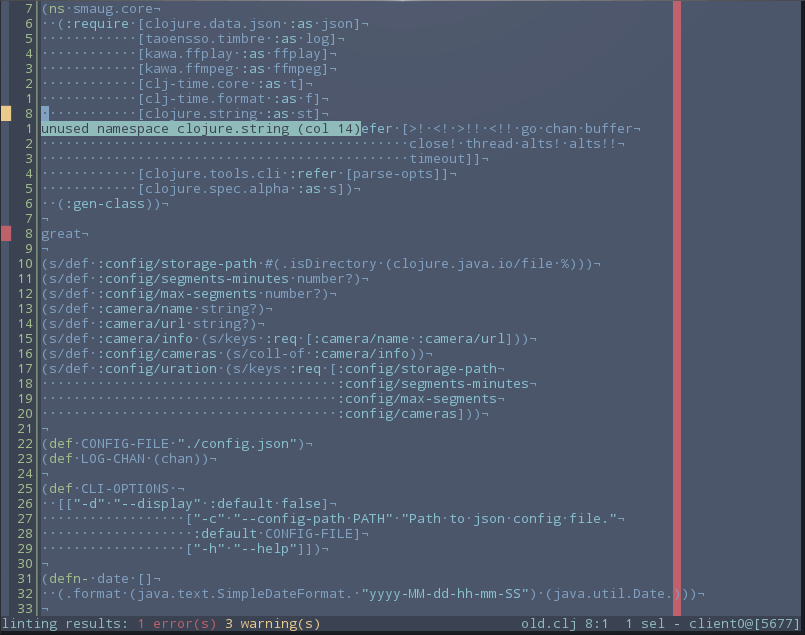

# clj-kakoune-joker



Just discovered kakoune and it is wonderful. I write a lot of clojure so i wanted
to add linting support.

`clj-kakoune-joker` is a simple shell script that adds linting support.

> Currently [joker](https://github.com/candid82/joker) only supports linting for
> JVM clojure.

## Installation & Configuration

1. Make sure you have [joker](https://github.com/candid82/joker) installed
   and available on your path.
2. Make sure `clj-kj.sh` is accessable on your path.
3. Modify your kakrc with the following options:
```
hook global WinSetOption filetype=clojure %{
    lint-enable
    set-option global lintcmd 'clj-kj.sh'
}
hook global BufWritePost .*\.(clj|cljc) %{
    lint
}
```

## Usage

Save your `clj` or `cljc` file and watch the magic.
